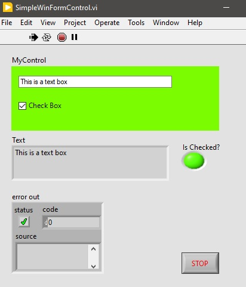
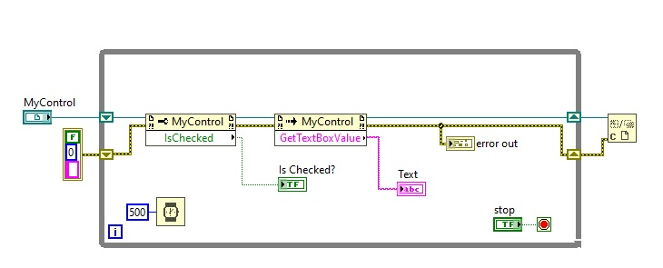
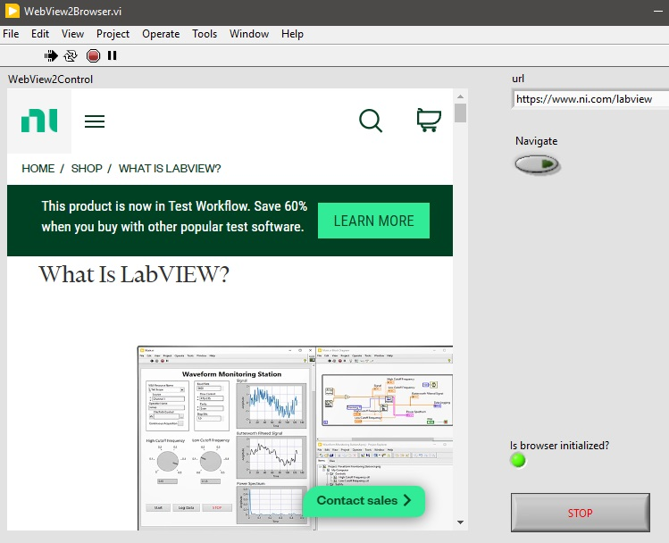
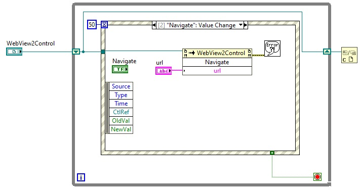

<h1>Embed .NET Controls on the LabVIEW Front Panel</h1>

- See LabVIEW documentation [here](https://forums.ni.com/t5/Developer-Center-Resources/Embedding-Hosting-NET-UI-Controls-on-a-LabVIEW-Front-Panel/ta-p/3523293)
- The .NET container supports hosting WinForms controls
- As of 2023, LabVIEW .NET container does not support hosting WPF controls

<h2>Requirements</h2>

- Visual Studio 2022
- .NET Framework 4.6.2 SDK
- Microsoft Edge or the [Microsoft Edge WebView2 Runtime](https://developer.microsoft.com/en-us/microsoft-edge/webview2/#download-section)
- LabVIEW 2020

<h2>Building the example WinForm controls</h2>

- Open `WinFormsApp.sln` with Visual Studio 2022
- The solution requires the [`Microsoft.Web.WebView2`](https://www.nuget.org/packages/Microsoft.Web.WebView2/1.0.1418.22) nuget package to be installed
- You can install the package by selecting `Restore NuGet Packages` on the solution
- Build the solution to create the .NET assembly that contains the .NET controls
- The assembly `WinFormsControls.dll` can be found in the `WinFormsControls\bin` directory

<h1>Simple WinForms control with a text box and a checkbox</h1>

- Open [examples/SimpleWinFormControl.vi](https://github.com/mhadikus/winforms-controls/blob/main/examples/SimpleWinFormControl.vi) with LabVIEW 2020 or later
- You will be prompted to locate `WinFormsControls.dll` in the built `WinFormsControls\bin` directory above
- The control has public properties and functions `IsChecked` and `GetTextBoxValue`

<h1>Chromium web browser</h1>

- Open [examples/WebView2Browser.vi](https://github.com/mhadikus/winforms-controls/blob/main/examples/WebView2Browser.vi) with LabVIEW 2020 or later
- You will be prompted to locate `WinFormsControls.dll` in the built `WinFormsControls\bin` directory above
- The example user control [`WebView2Control`](https://github.com/mhadikus/winforms-controls/blob/main/WinFormsControls/WebView2Control.Designer.cs) contains the Microsoft Edge [WebView2](https://learn.microsoft.com/en-us/microsoft-edge/webview2) control
- The control has a public function [`Navigate(string url)`](https://github.com/mhadikus/winforms-controls/blob/main/WinFormsControls/WebView2Control.cs#L19)
- Read Rick Strahl's [weblog](https://weblog.west-wind.com/posts/2021/Jan/14/Taking-the-new-Chromium-WebView2-Control-for-a-Spin-in-NET-Part-1) about the WebView2 control

